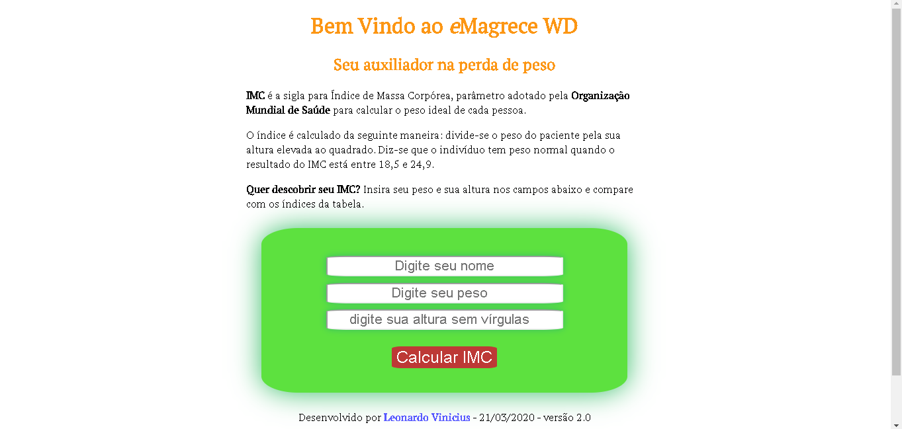
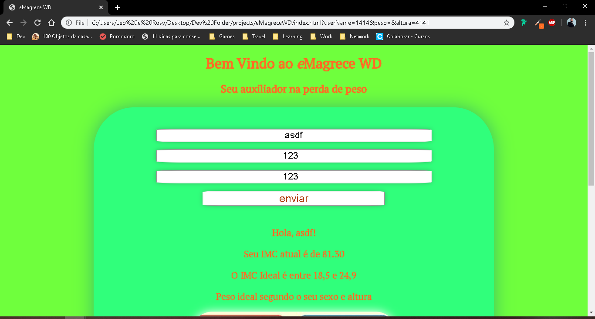

# Calculadora IMC:

Com essa calculadora, você poderá calcular o seu IMC, e saber se está no peso ideal.

## Link da Demo:
[*Demo*](https://leonardowd.github.io/CalcIMC/)

## Ferramentas e tecnologias:

Desenvolvi o aplicativo utilizando **HTML5**, **CSS3** e **JavaScript**. Não utilizei nenhum tipo de *framework* nem *API*.

A calculadora é responsiva, sendo desenvolvida utilizando *mobile first*, tendo um tamanho que pode ser utilizado tanto em celular, quanto tablets e monitores maiores.

### Imagens de exemplo:

**Tela Inicial(telas maiores):**

**Tela Após o click(telas maiores):**

### Desenvolvimento:

Esse projeto foi desenvolvido por **Leonardo Vinicius**  
[*GitHub:*](https://github.com/leonardowd)
[*Linkedin*](https://www.linkedin.com/in/leonardovinciuswd/)  
*E-mail:* leonardoviniciuswd@gmail.com
